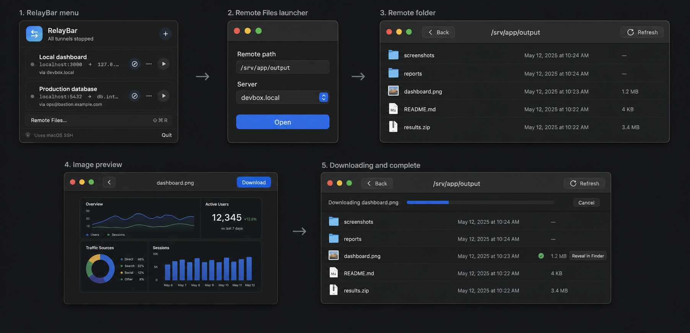

# Remote Files

Concept A is the approved direction for RelayBar's remote-file boundary.

## Product boundary

RelayBar opens an exact absolute path supplied by the user. It does not search for workspaces, index a server, mount a filesystem, or edit remote content.

The delivered flow is:

1. Select **Remote Files…** below the tunnel list.
2. Paste an absolute path copied from remote `pwd`.
3. Choose one saved server and select **Open**.
4. Enter folders, go back, or refresh the current listing.
5. Download a file or folder to a chosen local destination, or preview a supported image or Markdown document.

Read-only Markdown is delivered as the independently bounded [Task 002](../task-specs/archive/002-read-only-markdown.md) milestone.

## Interface

- The menu-bar popover gains one labeled row; its forwarding controls do not change.
- The launcher is a compact vertical form with only path, server, and **Open**.
- Successful opening expands into a wider table window with **Back**, current path, **Refresh**, and folder contents.
- Folders open by default. Supported images and Markdown documents preview by default. Other files download by default.
- A selected row exposes download without filling every row with controls.
- Image and Markdown preview replace the table temporarily and keep only **Back**, filename, and **Download**.
- Transfers use one temporary strip with progress and **Cancel**. Completion offers **Reveal in Finder**.

## Architecture

- `RemoteFilesWindowController` owns the one Remote Files window.
- `RemoteFilesModel` owns launcher, browser, image/Markdown preview, navigation, error, and transfer state.
- `SFTPRemoteFileService` invokes `/usr/bin/sftp` directly with no shell.
- `SFTPCommandBuilder` converts safe SSH connection arguments to their SFTP equivalents.
- `SFTPListingParser` converts bounded long listings into portable `RemoteFileEntry` values.
- SwiftUI views receive domain values and never parse process output.

Remote browsing does not require its saved port forward to be running. It reuses the saved server's host, user, port, identity, jump host, OpenSSH options, config, agent, and host-key behavior.

## Safety and limits

- Only absolute, single-line paths up to 32 KiB of UTF-8 are accepted.
- Batch paths escape backslashes and quotes; control characters are rejected.
- Listings are capped at 10,000 supported entries, 32 KiB per parsed line, and 4 KiB per entry name; negative sizes are rejected.
- Captured SFTP output is capped at 32 MiB and diagnostics at 1 MiB.
- Pipes and unsupported remote filesystem objects are omitted.
- Image preview is capped at 100 MiB and uses bounded ImageIO decoding.
- Markdown preview is capped at 2 MiB and uses the safe reader described in [Read-only Markdown](markdown-preview.md).
- Preview directories and command output use private temporary permissions.
- Downloads use hidden partial siblings, replace an existing destination only after success, and remove partial content after cancellation or failure.
- One transfer is active at a time.
- Remote paths, names, metadata, bytes, and process output are untrusted.
- RelayBar never reads, copies, logs, or stores private-key contents.
