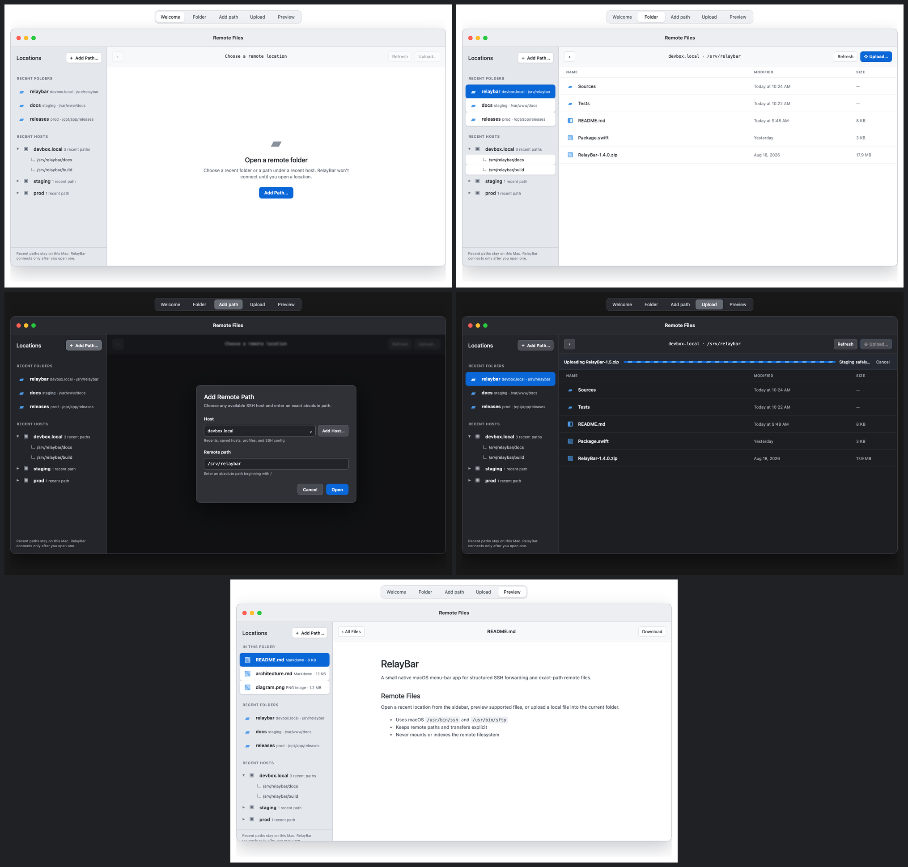

# Remote Files

The persistent workspace approved in Task 036 is the current Remote Files
direction.

## Product boundary

RelayBar opens an exact absolute path supplied by the user and remembers a
bounded local history of successful host-and-folder pairs. It does not search
for workspaces, index a server, mount a filesystem, synchronize content, or
edit remote text.

The delivered flow is:

1. Select **Remote Files…** below the tunnel list. The stable split workspace
   opens without connecting.
2. Activate a recent folder in one click, expand a recent host, or use **Add
   Path…** for a complete host choice and an absolute path copied from `pwd`.
3. Enter folders, go back, refresh, preview supported image or Markdown files,
   or download to a chosen local destination.
4. In an open folder, choose **Upload…** to stage and safely publish one local
   regular file. Existing regular files require explicit replacement consent.

Read-only Markdown is delivered as the independently bounded [Task 002](../task-specs/archive/002-read-only-markdown.md) milestone.

## Interface

- The menu-bar popover has one labeled row; its forwarding controls do not change.
- The 920 × 600 window keeps one hideable leading sidebar across welcome,
  browser, loading, error, transfer, and preview states.
- **Recent Folders** provides the fastest route to common roots. **Recent
  Hosts** discloses bounded paths not already visible globally. **Add Path…**
  replaces the old persistent form.
- Focus traversal never connects. Pointer press, Return, or accessibility press
  explicitly activates a location.
- The detail toolbar keeps **Back**, current path, **Refresh**, and one trailing
  **Upload…** action.
- Folders open by default. Supported images and Markdown documents preview by default. Other files download by default.
- A selected row exposes download without filling every row with controls.
- Image and Markdown preview stays in the detail while **In This Folder** joins
  recents in the same sidebar. Detail-focused Left/Right switches siblings;
  sidebar-focused arrows navigate without preview side effects.
- Downloads use their existing progress strip and Finder reveal. Uploads use an
  indeterminate phase strip with **Cancel** and truthful cleanup outcomes.

## Architecture

- `RemoteFilesWindowController` owns the one Remote Files window.
- `RemoteFilesModel` owns welcome, browser, image/Markdown preview, navigation,
  recent-root, error, upload, and download state.
- `SFTPRemoteFileService` invokes `/usr/bin/sftp` directly with no shell and
  owns capability probing, hidden staging, publication, and cleanup.
- `SFTPCommandBuilder` converts safe SSH connection arguments to their SFTP equivalents.
- `SFTPListingParser` converts bounded long listings into portable `RemoteFileEntry` values.
- SwiftUI views receive domain values and never parse process output.

Remote browsing does not require its saved port forward to be running. It reuses the saved server's host, user, port, identity, jump host, OpenSSH options, config, agent, and host-key behavior.

## Safety and limits

- Only absolute, single-line paths up to 32 KiB of UTF-8 are accepted.
- Batch paths escape backslashes and quotes; control characters are rejected.
- Listings are capped at 10,000 supported entries, 32 KiB per parsed line, and 4 KiB per entry name; negative sizes are rejected.
- Captured SFTP output is capped at 32 MiB and diagnostics at 1 MiB.
- Pipes and unsupported remote filesystem objects are omitted.
- Image preview is capped at 100 MiB and uses bounded ImageIO decoding.
- Markdown preview is capped at 2 MiB and uses the safe reader described in [Read-only Markdown](markdown-preview.md).
- Preview directories and command output use private temporary permissions.
- Downloads use hidden partial siblings, replace an existing destination only after success, and remove partial content after cancellation or failure.
- One upload or download is active at a time.
- Uploads publish a new name only through an advertised hard link and replace
  an approved regular file only through advertised POSIX rename. Missing
  guarantees, changed target types, collisions, and master replacement fail
  closed. Exact staging cleanup never uses a wildcard or recursive delete.
- Remote paths, names, metadata, bytes, and process output are untrusted.
- RelayBar never reads, copies, logs, or stores private-key contents.
