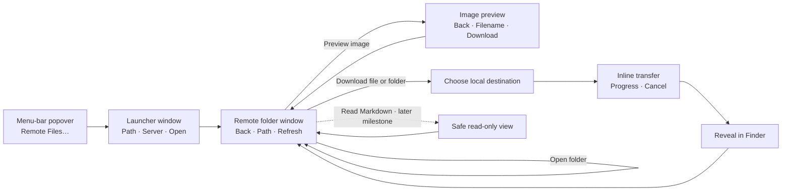

# Task 001 — Remote Files

Status: Complete

Created: 2026-07-23

Accepted: 2026-07-24

Direction: Concept A selected on 2026-07-23

## Outcome

Implement the selected Concept A experience for opening and downloading files from Claude Code, Codex, or a remote terminal.

The entry flow is intentionally exact: select **Remote Files…** in the RelayBar popover, paste an absolute path copied from remote `pwd`, choose a saved server, and select **Open**. RelayBar opens that folder without searching for a workspace, indexing the remote filesystem, or replacing the remote tool's editing features.

This task delivers roadmap items 2.1 through 2.5: exact-path opening, folder navigation, file download, recursive folder download, and image preview. Read-only Markdown is independently scoped by [Task 002](002-read-only-markdown.md). This task does not deploy the feature.

## Delivery Boundary

### Included

- Selecting a saved server and entering a required absolute remote path.
- Listing that exact folder, entering its subfolders, going back, and refreshing.
- File download and recursive folder download with native destination selection, progress, cancellation, safe replacement, and Finder reveal.
- Bounded, read-only image preview.
- Authentication through the user's existing OpenSSH config, identities, and SSH agent.
- Transport, process lifecycle, cancellation, temporary-file policy, limits, errors, accessibility, and security requirements.
- Unit coverage, system documentation, and verification evidence for the delivered behavior.

### Excluded

- Deployment.
- Remote search, filtering, indexing, workspace discovery, and a default home-folder browser.
- Mounting a remote folder in Finder.
- Upload, edit, rename, move, delete, synchronization, and permission changes.
- Password or private-key collection and storage.
- A terminal, general-purpose file manager, gallery, image editor, or Markdown editor.
- Read-only Markdown rendering, which belongs to Task 002.

## User Experience

### 1. Menu-bar entry

- Add one full-width, labeled **Remote Files…** row below the tunnel list and above the existing **Uses macOS SSH** / **Quit** footer.
- Do not add an icon-only header action, tab, sidebar, or permanent second navigation mode.
- Leave the existing tunnel header, rows, and controls unchanged.
- Selecting the row opens or focuses the Remote Files launcher in a separate window and closes the popover normally.

### 2. Launcher window

- Present a small native utility window with a title bar and a single vertical form.
- Show **Remote path** first, **Server** second, and one full-width primary **Open** button last.
- Accept one absolute remote path. Do not provide workspace discovery, recent paths, path suggestions, browsing from home, or explanatory onboarding.
- Submit with **Open** or Return when both values are valid. Keep validation beside the affected field.
- Replace the launcher with the folder window after the requested path loads successfully. On failure, keep both entered values and offer one clear retry.

### 3. Remote folder window

- Use a wider native window than the menu-bar popover.
- Keep the top bar limited to **Back** on the left, the exact current path in the center, and **Refresh** on the right.
- Present one quiet table with icon, name, modified date, and size. Show folders before files; do not add cards.
- Opening a folder is the default folder action. Opening a supported image shows its preview. Other files expose **Download** without inventing a generic preview.
- Make file and folder download available through a conventional contextual or row action without leaving permanent action buttons on every unselected row.
- Preserve the current folder, selection, and scroll position when returning from preview or a destination picker.
- Do not add search, filters, indexing, breadcrumbs, sidebar, inspector, terminal output, or status dashboard.

### 4. Image preview

- Replace the folder contents with a focused preview state in the Remote Files window.
- Keep the top bar limited to **Back**, the filename, and **Download**.
- Fit the image inside the available space without upscaling small images or hiding its edges.
- Show a quiet loading state, then either the image or an inline failure with **Try Again** and **Download**.
- Returning restores the exact folder selection and scroll position.
- Do not add a thumbnail rail, gallery navigation, metadata inspector, markup, or editing controls.

### 5. Transfer feedback

- Ask for a local destination with the standard macOS save/folder picker.
- Show one slim transfer strip directly below the folder window's top bar while a transfer is active.
- Include the item name, determinate progress when available, transferred and total size, and **Cancel**.
- Keep completed content at its chosen destination. Offer **Reveal in Finder**, then let the strip dismiss without creating a downloads screen or history.
- On cancellation or failure, state exactly what was kept or removed and offer the smallest safe recovery action.
- Within Task 001, Markdown files remain ordinary downloadable files; Task 002 owns their preview behavior.

### 6. Visual and accessibility rules

- Follow the restrained native macOS appearance shown in Concept A: system typography, blue accent, subtle materials, and minimal decoration.
- Support both light and dark appearance even though Concept A is shown in dark mode.
- Use visible labels for primary actions and standard keyboard behavior: Return to open, arrow keys to move selection, Command-Down to open, Space to preview supported images, Command-R to refresh, and Escape to return or cancel where safe.
- Errors replace only the content they affect and never open a log console.

## Work

### 1. Open a pasted path

- Implement the labeled popover row and compact launcher exactly as defined by Concept A.
- Collapse forwarding presets with the same SSH host and SSH arguments into one server-picker entry without merging distinct aliases or connection arguments.
- Reject empty, relative, option-shaped, multiline, control-bearing, and otherwise unsafe path, host, and SSH-option input without invoking a shell.
- Specify initial loading, empty, missing-path, permission, authentication, connection-loss, cancellation, and retry behavior.
- Preserve the tunnel controls while the remote-folder window is open.

### 2. Navigate folders

- Implement the wider table-based folder window, enter-folder, back, current-path, refresh, selection, fixed folder-first ordering, and state-restoration behavior.
- Keep navigation in the dedicated window so the menu-bar popover remains focused on port forwarding.
- Explicitly exclude search, filtering, indexing, path discovery, and a default home-folder view.

### 3. Download a file

- Implement the contextual download action, macOS destination picker, slim transfer strip, cancellation, overwrite handling, partial files, cleanup, and **Reveal in Finder**.
- Set initial size and concurrency limits.

### 4. Download a folder

- Implement recursive transfer, destination conflicts, symlinks, permissions, progress aggregation, cancellation, partial-failure reporting, and cleanup.
- Keep this independently testable from single-file download.

### 5. Preview images

- Implement the focused preview state with **Back**, filename, and **Download** as its only permanent chrome.
- Make preview the default action for supported images while retaining the explicit download action.
- Define supported formats, bounded temporary transfer, native decoding, loading, state restoration, malformed-image behavior, cache limits, and cleanup.
- Exclude gallery organization and editing.

### 6. Keep Markdown independent

- Keep Markdown files downloadable as ordinary files.
- Do not add Markdown parsing, rendering, source editing, or remote save behavior in this task.
- Preserve roadmap item 2.6 as the independently reviewed Task 002 milestone.

### 7. Implement the shared technical boundary

- Use built-in `/usr/bin/sftp` through structured process arguments and batch input without invoking a shell.
- Reuse existing SSH host, port, jump-host, identity, config, agent, and host-key behavior without weakening `SSHArgumentPolicy`.
- Define service contracts so listing, downloads, image preview, and Markdown rendering do not parse process output inside SwiftUI views.
- Treat remote paths, names, metadata, bytes, and subprocess output as untrusted input.

### 8. Document and verify

- Record the interaction and architecture in `docs/designs/remote-files.md`.
- Update current system specs and user-facing documentation.
- Record unit, build, visual, accessibility, security, cancellation, and live-SSH evidence.

## Acceptance

- A reviewer can follow the complete flow from pasted `pwd` output and server selection to an exact remote folder without inferring workspace discovery or search.
- The implemented UI remains recognizably consistent with the selected Concept A reference.
- The menu-bar popover adds one labeled **Remote Files…** row below the tunnel list and no icon-only entry, tab, or second navigation mode.
- The launcher has exactly one path field, one server picker, and one primary action.
- The server picker shows each exact SSH connection configuration once, even when several forwarding presets use it.
- The launcher gives way to a wider folder window after a successful open instead of embedding file browsing in the popover.
- The folder window's permanent chrome is limited to **Back**, current path, **Refresh**, and the directory table.
- The image preview's permanent chrome is limited to **Back**, filename, **Download**, and the image.
- Active download feedback is a slim, cancellable strip; completion offers **Reveal in Finder** without creating persistent history.
- Back navigation stays disabled from both root and nested folders until an active transfer has finished or completed cancellation cleanup.
- Folder, supported-image, download, transfer, completion, and error actions follow the interaction rules without requiring a terminal or hidden gesture.
- Light appearance, dark appearance, keyboard navigation, long paths, long filenames, empty folders, and narrow practical window sizes are resolved in the annotated design.
- The public roadmap and detailed design agree that port forwarding is complete and distinguish Remote Files from the separately reviewed Markdown milestone.
- Path opening, folder navigation, file download, folder download, and image preview work through one coherent window flow.
- Task 001 introduces no Markdown renderer or editor; read-only rendering is reviewed independently under Task 002.
- No milestone introduces remote search or editing.
- The SFTP transport works with built-in macOS 13 capabilities, invokes no shell, requires no additional transport dependency, and preserves the existing SSH security boundary.
- Imported and persisted SSH option values cannot be empty or contain control/newline characters, and the same policy is rechecked before SSH or SFTP launch.
- Resource limits, private temporary storage, cleanup, accessibility, error recovery, and untrusted-input handling are testable for every milestone that transfers or renders data.
- Bounded image decoding runs away from the main UI actor and publishes only a completed image.
- Unit tests, the warnings-as-errors Xcode build, and `git diff --check` pass.
- A real saved server/path is exercised for listing, navigation, file download, folder download, cancellation, image preview, and connection failure.
- System specs, user documentation, and the Task 001 verification report describe current behavior and remaining limitations.
- No release, publication, notarization, or deployment occurs without separate user approval.

## Completion Artifacts

- `docs/designs/remote-files.md`
- `docs/designs/media/001/remote-files-concept-a.png`
- Remote Files source and unit tests
- Updated system specs and user documentation
- `docs/verification/001-remote-files.md`

Accepted on 2026-07-24. Release packaging, notarization, publication, and deployment remain separate work requiring explicit authorization.
