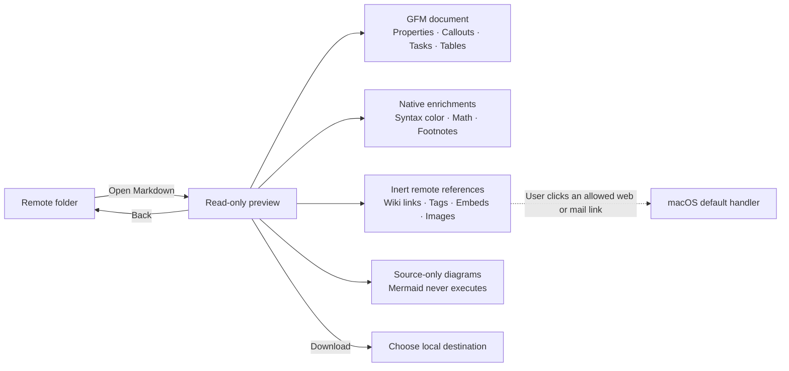

# Task 002 — Read-only Markdown

Status: Complete

Created: 2026-07-24

Accepted: 2026-07-24

## Outcome

Add an Obsidian-class reading view for remote Markdown without turning RelayBar into an editor, vault manager, browser, or code-execution surface.

Opening a supported Markdown file uses the same focused preview state as an image: **Back**, filename, **Download**, and the document. The reader preserves the most useful Obsidian and GitHub reading conventions while keeping all remote content inert by default.

## Delivery Boundary

### Included

- UTF-8 Markdown files with `.md`, `.markdown`, `.mdown`, and `.mkd` extensions.
- CommonMark and GitHub-flavoured headings, lists, tasks, tables, blockquotes, links, strikethrough, inline code, and fenced code.
- Obsidian-style properties, callouts, custom completed-task markers, `==highlights==`, `%% comments %%`, wiki-link labels, inline and nested tags, inert relative Markdown links, block identifiers, embeds, named and inline footnotes, inline math, and display math.
- Explicit-language syntax highlighting, code copying, text selection, dark/light appearance, and a centered reading column.
- Safe handling for raw HTML, normal images, embeds, wiki links, external links, Mermaid source, large documents, malformed text, expensive code blocks, and expensive formulas.
- Exact dependency pins, bundled third-party notices, security/privacy documentation, tests, and verification evidence.

### Excluded

- Editing, saving, uploading, renaming, or otherwise changing remote content.
- Vault discovery, search, indexing, backlinks, graph view, tags browser, plugins, themes, canvas, or workspace state.
- Automatic image or embed retrieval.
- Resolving wiki links to other remote files.
- Executing Mermaid, JavaScript, HTML, plugins, or any document-provided program.
- Pixel-identical Obsidian rendering. RelayBar implements reading compatibility within a native macOS 13 safety boundary.
- Deployment or publication.

## User Experience

- The toolbar remains **Back**, filename, and **Download**.
- The document uses a centered, selectable reading column and scrolls as one continuous page.
- Wide tables scroll horizontally inside the reading column instead of widening or clipping the document.
- Properties and callouts use quiet native containers rather than a new sidebar.
- Code blocks show a language label and **Copy**. Highlighting runs only for a known, explicit language and a bounded block.
- Math renders locally with a native renderer. A failed formula falls back to selectable source.
- A wiki link is visibly a link but explains that remote vault resolution is unavailable when clicked.
- A valid inline tag is visibly a link but explains that RelayBar does not index or search the remote vault when clicked.
- A relative Markdown link remains visibly labelled and gives the same remote-vault explanation without resolving or fetching it.
- An embed or Markdown image is represented without fetching it. Inline, full-reference, collapsed-reference, and shortcut-reference Markdown images retain their author-provided alt text as selectable not-loaded content; Obsidian width and width-by-height hints remain inert and are not shown as part of that label.
- Mermaid is shown as source with a clear “not executed” safety label.
- External HTTP, HTTPS, and email links open only after the user clicks them. Other schemes remain blocked.

## Work

1. Parse a privately downloaded preview only after enforcing a 2 MiB metadata and transfer limit, bounded file reading, UTF-8 decoding, NUL rejection, and cancellation checks.
2. Translate the supported Obsidian reading syntax, including single-character completed-task markers, inline and nested tags, and normally indented nested lists, outside fenced, indented, and inline code without altering the original downloaded source.
3. Render GFM with MarkdownUI, syntax-highlight bounded explicit-language blocks with HighlighterSwift/highlight.js, and render bounded formulas with SwiftMath.
4. Never execute raw HTML; keep active HTML tags such as `script` and `style` literal; replace remote images and embeds with inert states that preserve inline and reference-image alt text; keep Mermaid source-only; handle tags and relative Markdown links locally without fetching, and block file, data, JavaScript, credential-bearing, unknown, and forged private links.
5. Preserve browser selection and temporary-file cleanup when entering, retrying, leaving, cancelling, or superseding a preview.
6. Pin dependencies exactly, include notices in the app bundle, document the security boundary, and cover compatibility and limit behavior with automated tests.
7. Exercise dark/light layout, keyboard return, accessibility structure, long content, malformed content, and failure fallbacks in the local debug harness.

## Acceptance

- A supported Markdown file opens from the Remote Files list and returns to the same selected row.
- The permanent preview chrome is limited to **Back**, filename, and **Download**.
- Standard GFM headings, tasks, tables, links, blockquotes, strikethrough, and fenced code render legibly and remain selectable.
- Headings expose native accessibility header traits, task markers announce completion state, and wide tables preserve access to every column.
- Obsidian task markers containing any non-space character render as completed, including inside normally indented nested lists, without changing the downloadable source.
- Properties, callouts, highlights, comments, named and inline footnotes, wiki-link labels, inline tags, block identifiers, embeds, and math have the documented safe reading behavior outside code.
- Valid tags preserve nested paths, case, Unicode letters, and emoji while remaining inert local references. Numeric-only tags, URL fragments, escaped tags, `C#`, CSS colour fragments, and tag-looking text inside code remain literal; clicking a rendered tag explains that RelayBar does not index or search the vault.
- Compatibility syntax inside inline code—including code spans across soft line breaks—plus fenced and indented code remains literal.
- Known explicit-language code blocks at or below 64 KiB receive local syntax highlighting within a 128-labelled-block document budget; unknown, unlabelled, oversized, or overflow blocks remain readable plain text. Mermaid keeps its source-only safety label independently of that budget.
- Copying code is a user-initiated local pasteboard action with visible confirmation.
- Markdown-image URLs never trigger network or local-file loading; inline, full-reference, collapsed-reference, and shortcut-reference images retain visible, selectable alt text outside code. Obsidian image dimension hints, including table-escaped hints, remain inert metadata rather than visible alt text.
- Raw HTML never executes; active tags such as `script` and `style` are displayed as text, including multi-line tags and tags inside Markdown link labels. Mermaid and other diagram code is never executed.
- Only user-clicked absolute HTTP, HTTPS, and email links reach the system handler; credentials, raw or percent-decoded control characters, and all other schemes are rejected.
- Wiki links, tags, relative Markdown links, footnote links, and embeds never cause an implicit remote transfer.
- Markdown is capped at 2 MiB and valid UTF-8 without NULs. Rendering enriches at most 256 formulas, 1,024 extracted footnotes, 2,048 internal links, 512 image or embed placeholders, and 128 labelled code blocks per document. Formulas are capped at 4,096 characters and bounded display dimensions; all overflow content remains readable source.
- Preview parsing is cancellable and does not publish stale results after a newer preview starts.
- Published preview state does not additionally retain both the original and compatibility-transformed Markdown strings.
- Preview-owned temporary files are private and removed on error, exit, window close, cancellation, or replacement.
- Exact dependency versions and required license notices are present.
- `swift test`, the complete strict-concurrency and warnings-as-errors RelayBar target build, `plutil -lint`, and `git diff --check` pass.
- Manual visual and accessibility evidence is recorded in `docs/verification/002-read-only-markdown.md`.
- No release, notarization, publication, or deployment occurs without separate explicit user approval.

## Completion Artifacts

- Markdown preview and compatibility source
- Focused unit and model tests
- `docs/designs/markdown-preview.md`
- Updated system, privacy, and security documentation
- `docs/verification/002-read-only-markdown.md`
- Bundled `THIRD_PARTY_NOTICES.txt`

Accepted on 2026-07-24.
